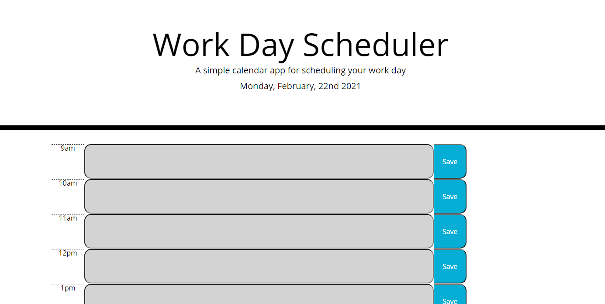

# DayPlanner

This is a simple day planner. When you first load the page you will see what the date is for that day. Below you will see inputs to schedule meetings or appointments during normal business hours. Once you enter an input, you can click the save button to keep it there when you refresh the page. Gray time slots signify that time block has passed. Red signifies it is in the current hour and green is in the future. 

https://ohskie3.github.io/DayPlanner/

